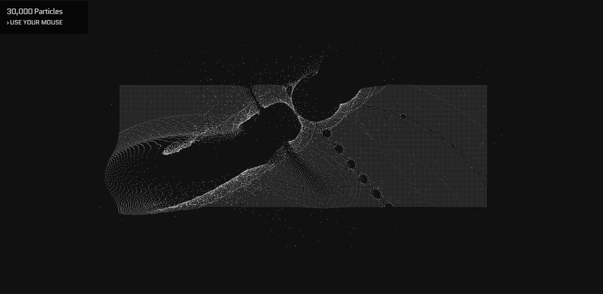

# Mouse-Experiment

Interactive Mouse
 
         

 
<a href="https://houssemlachtar.github.io/Mouse-Experiment/">
        Demo
    </a>

## Used Tools

  
Used Libraries

  

1. [Prefixfree JS](https://cdnjs.com/libraries/prefixfree).
2. [RequestAnimationFrame API](https://developer.mozilla.org/en-US/docs/Web/API/window/requestAnimationFrame).      
3. [Stats JS](https://github.com/mrdoob/stats.js/).
4. [Reset CSS](https://meyerweb.com/eric/tools/css/reset/).
        

## Partially Responsive ✔️

## Follow me on

[Instagram](https://www.instagram.com/houssem_lachtar/), [Linkedin ](https://www.linkedin.com/in/houssem-lachtar/), [Codepen](https://codepen.io/houssem-lachtar), [GitHub](https://github.com/houssemlachtar)
